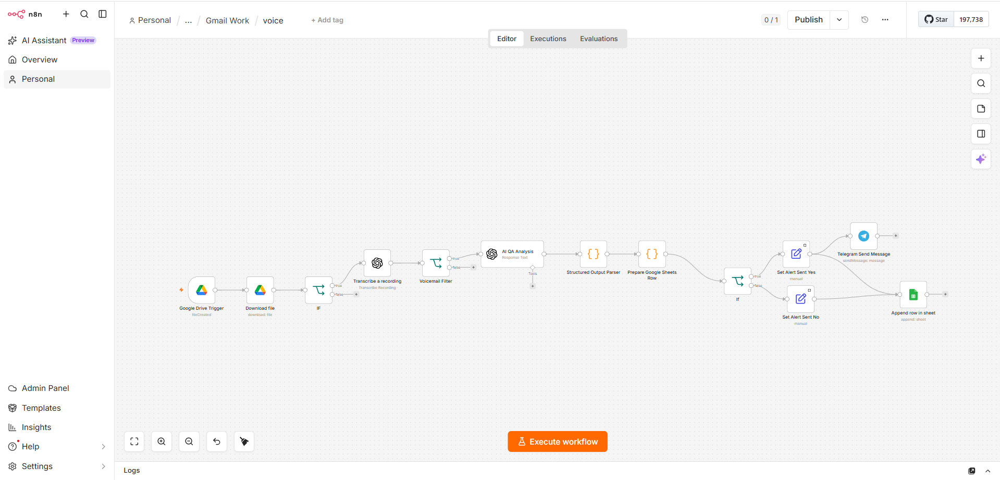
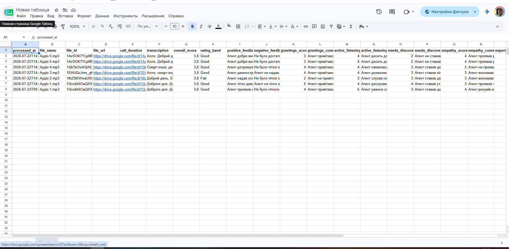

# AI Call Quality Monitoring

> AI-powered customer call evaluation system built with n8n, OpenAI, Google Drive, Google Sheets, and Telegram.

---

# 📌 Overview

This project automates the quality assessment of customer service calls.

Instead of manually listening to recordings, the system automatically transcribes conversations, evaluates operator performance using AI, extracts strengths and weaknesses, assigns scores for multiple communication criteria, stores the results in Google Sheets, and notifies supervisors when attention is required.

---

# 🎯 Business Problem

Manual quality control is slow, expensive, and inconsistent.

Supervisors often spend hours listening to calls, filling evaluation forms, and preparing reports.

This workflow reduces manual effort while providing standardized AI-powered evaluations.

---

# 💡 Solution

The workflow automatically:

- Retrieves new call recordings
- Converts speech to text
- Sends transcripts to OpenAI
- Evaluates call quality
- Generates structured feedback
- Stores results in Google Sheets
- Sends alerts when poor performance is detected

---

# ⚙️ Workflow

```text
Customer Call
        │
        ▼
Google Drive
        │
        ▼
Speech-to-Text
        │
        ▼
OpenAI Analysis
        │
        ▼
Quality Evaluation
        │
        ▼
Google Sheets
        │
        ▼
Telegram Notifications
```

---

# ⭐ Features

- AI-powered call evaluation
- Automatic transcription
- Positive and negative feedback extraction
- Greeting quality assessment
- Active listening evaluation
- Needs discovery scoring
- Empathy analysis
- Product knowledge evaluation
- Solution quality assessment
- Next-step verification
- Closing quality evaluation
- Automatic reporting
- Telegram alerts

---

# 🛠 Tech Stack

- n8n
- OpenAI
- Google Drive
- Google Sheets
- Telegram Bot API
- JavaScript

---

# 📈 Business Value

- Reduces manual QA time
- Standardizes operator evaluation
- Provides consistent scoring
- Improves coaching process
- Enables faster feedback
- Creates historical performance reports

---

# 📷 Screenshots



## Dashboard



---

# 🚀 Future Improvements

- Dashboard
- Trend analysis
- Multi-language support
- Voice sentiment analysis
- CRM integration
- Real-time monitoring

---
## 📊 Results

### Before

❌ Manual call review

❌ Hours of listening

❌ Inconsistent scoring

❌ Delayed feedback

---

### After

✅ AI evaluates every call

✅ Standardized scoring

✅ Automatic reports

✅ Instant Telegram alerts

✅ Historical analytics

# 👨‍💻 Author

**Serhii Buts**

AI Automation Engineer

LinkedIn:
https://linkedin.com/in/sergii-buts-ai
